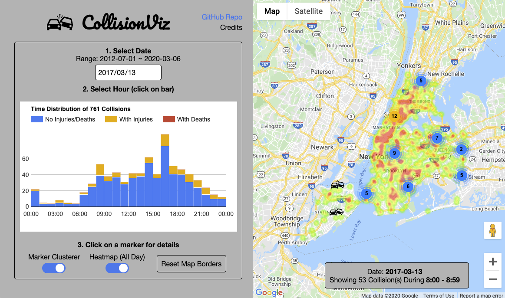

# CollisionViz

[Live](https://collisionviz.davidfeng.us/)

CollisionViz is a data visualization web app for motor vehicle collisions in New York City. It is built with

* React.js
* SASS
* [Google Maps JavaScript API](https://developers.google.com/maps/documentation/javascript/)
* [Google Charts](https://developers.google.com/chart/)
* [NYPD Motor Vehicle Collisions API](https://dev.socrata.com/foundry/data.cityofnewyork.us/h9gi-nx95)

## How to Use

1. Select the date. The app will load all the collisions on that day from NYPD API, and show a time distribution chart and a heatmap.
2. The app also shows markers for collisions that happened during 8AM-9AM. Click on the chart to change the hour. Click on a marker for collision details.

## How to Develop

1. `npm install`: installs node_modules and also builds development version of `bundle.js` and `main.css`, which can also be generated with `npx webpack` and `npx sass src/scss/main.scss main.css`
2. `NODE_ENV=production npx webpack`: builds production / minified version of `bundle.js` 
3. `npm start`: webpack watches jsx file changes
4. Open `index.html` in browser to see the app.
5. `npm audit fix` to fix security issues in node modules.

## Recent Changes

* 8/1/2020: updated dependencies
* 3/16/2020: [major update](https://davidfeng.us/2020/03/advice-to-new-programmers/)
  * Add
    * adaptors for third party APIs
  * Change
    * reorganize files and directories
  * Remove - less is more
    * play/pause mechanism
    * custom crash icons
    * map layers
    * Redux

## Future Work

* get date and time from URL query params
* use GitHub Actions to run `npm start` whenever master branch is updated, so that `bundle.js` does not have to be in this repo.