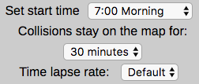
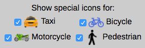

# CollisionViz
Interact with CollisionViz [here](https://collisionviz.davidfeng.us/) or [here](https://collisionviz.herokuapp.com/).

CollisionViz shows the location and time of motor vehicle collisions in New York City on 6/22/2017 (Friday). It uses Ruby on Rails, a PostgreSQL database, React.js, Redux, and Google Maps JavaScript API. Collision data are from NYPD.


## Features
### Control panel
The control panel is consisted of three parts:

- Basic settings

- The player

  * Play: starts/resumes the visualization
  * Pause: pauses the visualization
  * Reset: resets the basic settings to default values
  * Step backward: move map time one minute backward
  * Step forward: move map time one minute forward
  * Unmute/mute: turn on and off background traffic sound
- Icon settings


The user can choose to show custom icons for collisions involving taxis, bicycles, motorcycles, and collisions that caused pedestrian injuries or deaths.

**Note**: this does not change the icons that are already on the map. Also, the icons have priorities as taxi > bicycle > motorcycle > pedestrian (e.g. if a taxi hit a bicycle, the icon would be a taxi).

### Map

During the visualization, markers representing collisions appear on the map at the corresponding time recorded in the NYPD database.

**Note**: the number of collisions on the round clock (e.g. 13:00) may be overrated.

- Map panel
The user can toggle four layers on and off the map. By default, the heat map layer is turned on while the other three are turned off.
  * The heat map layer: shows a heat map based on all the collisions on 6/22/2017. One injury is counted as five normal collisions (where nobody was injured or killed). One death is counted as 100 normal collisions (fortunately the number of deaths is 0 on that day).
  * The traffic layer: shows the real-time (user time) traffic information.
  * The transit layer: displays the public transit network.
  * The bicycling Layer: renders bike paths, suggested bike routes and other overlays specific to bicycling usage.
  * Reset map: resets the map center and zoom level to default values.
- Map information box
Shows current map time, the number of collisions on the map, and the time range of those collisions.
- Interaction with the map
When the user resizes/moves the map, collisions that are outside of the map border are eliminated, map info panel is updated accordingly.

When the user clicks on the marker on the map, a box containing details of the collision appears.

### Collision details

The `id` column and columns with `null` or `0` values are not shown.

Data in the `Time` column is of `datetime` type and are in [Coordinated Universal Time (UTC)](https://www.wikiwand.com/en/Coordinated_Universal_Time). The local time in New York City is UTC-04:00 (with daylight saving time).

## Implementation

### Sample Redux state
```
{
  options: {
    bike: true,
    taxi: true,
    ...
  },
  collisions: {
    59: {
      borough: "Brooklyn",
      contributing_factor_vehicle_1: "Unspecified",
      contributing_factor_vehicle_2: "Unspecified",
    },
    60: {
      ...
    }
    ...
  },
  highlight: {
    borough: null,
    contributing_factor_vehicle_1: "Reaction to Other Uninvolved Vehicle",
    ...
  }
}
```

The state contains three slices:

- `options`
This slice contains options for the map icons (e.g. whether to show special icons for taxis or not) and filters for the collisions (map bounds, start time and finish time).
  * Options: options are set by the control panel and used by the map component.
  * Filters: start time and finish time are set by the control panel and used by the map information box. Map bounds is set by the map. Whenever a filter is updated, an AJAX request is sent to the backend with the filter, and collisions that meet those conditions are populated in the `collisions` slice.
- `collisions`
This slice contains all the collisions that meet the filter conditions. It is set by the filters, and it is used by the map component.
- `highlight`
When the user clicks on a marker on map, an AJAX request is sent to the backend with the collision's id, and its information is populated in this slice.

This slice contains information of the highlighted collision, which is shown in the `Highlight` component. It is created because we want the highlighted collision information to persist even if the collision is not in the `collisions` slice anymore, i.e. after the corresponding marker disappears from the map.

The `Highlight` component will render if the `highlight` slice of the state is not `null`.

### Filtering the collisions
The internal state of `ControlPanel` component contains a field for `currentTime`. `oneStepForward` function increases `currentTime` by one minute, calculates the `start` and `finish` options (with `collisionMapTime`, which is set by the user), and updates the `collisions` slice of the Redux state with collisions which happened in the new time range. The map then renders markers for the collisions.

Several edge cases are also handled. For example, when the visualization just started, collisions happened before the start time should not be shown.

The `handlePlay` function uses the `setInterval` function to call `oneStepForward` repeatedly. The delay time is set by the user. The `handleStop` function calls the `clearInterval` function.

### Map
The `marker_manager` updates markers on the map based on the collisions in the Redux state. Markers have `onClick` listeners, which dispatches an action to update the `highlight` slice of the state.

The `MapInfo` component receives `start` and `finish` time from the `options` slice of the state and renders them.

[Custom markers](https://developers.google.com/maps/documentation/javascript/custom-markers), [heatmap](https://developers.google.com/maps/documentation/javascript/heatmaplayer), and [traffic, transit and bicycling layer](https://developers.google.com/maps/documentation/javascript/trafficlayer) are created using the Google Maps JavaScript API.

### Data import
The [NYPD data][data_link] come in a CSV file. The entries were imported to a PostgreSQL database using Active Record.

[data_link]: https://data.cityofnewyork.us/Public-Safety/NYPD-Motor-Vehicle-Collisions/h9gi-nx95

## Future Directions

### Show collisions in multiple days
Include collision data from multiple days and allow the user to select the date. Compare time/location distributions of collisions between different days (e.g. weekday vs. weekend, winter vs. summer, rainy vs. sunny, etc.).

### Incorporate other tools
* [Fusion Tables](https://developers.google.com/maps/documentation/javascript/fusiontableslayer): to handle [heat map](https://developers.google.com/maps/documentation/javascript/heatmaplayer) and collision data.
* [Google BigQuery](https://cloud.google.com/bigquery/public-data/nypd-mv-collisions): to enhance scalability.
* [Firebase](https://firebase.google.com/): to host collision data.
