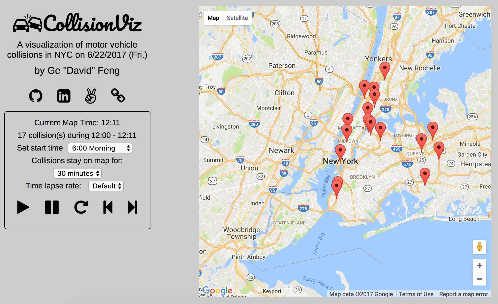

# CollisionViz
[CollisionViz live][heroku]

[heroku]: http://collisionviz.davidfeng.us/

CollisionViz is a web application which visualizes the location and time of all the motor vehicle collisions during a certain period of time in New York City. On the back-end, CollisionViz utilizes Ruby on Rails and a PostgreSQL database; on the front-end, it uses React.js with a Redux architectural framework. Currently, it shows collisions on 6/22/2017. Data are from NYPD.

## Features
The user can set the start time of the visualization, how long (map time) a collision stays on the map, and the time lapse rate. The "Reset" button resets these settings to defaults.
The user can start/pause/resume the visualization. The user can also step 1 minute (map time) forward or backward when the visualization is paused.
During the visualization, a marker for a certain collision appears on the embedded Google Map on the corresponding time in the NYPD database, so the number of collisions on the round clock (e.g. 13:00) might be overrated. After a certain time (set by the user), the marker disappears. the current map time and the number of collisions are updated simultaneously.

## Implementation

### Data import
The [NYPD data][data_link] are in a CSV file. The entries were imported to a PostgreSQL database using ActiveRecord.

[data_link]: https://data.cityofnewyork.us/Public-Safety/NYPD-Motor-Vehicle-Collisions/h9gi-nx95

### Filtering the collisions
The `filter_form` front-end component converts the current map time and the time a collision stays on map into start and finish time to filter the collisions. It also handles several edge cases, for example, when the visualization just started, collisions happened before the start time should not be included.

### The player
In the `filter_form`, the `oneStepForward` and `oneStepBackward` functions move the current map time 1 minute forward and backward respectively.
In the internal state of the `filter_form`, I set a `intervalId` field to store the intervalId. Default value is null (visualization is not playing).
If the visualization is not playing, the `handlePlay` function calls the `setInterval` function, with the `oneStepForward` callback and a interval time, which comes from the setting for map time lapse rate. It also stores the intervalId in the internal state.
The `handleStop` function calls the `clearInterval` function, and set the intervalId in the internal state to null.

## Future Directions

### Collision filter by map borders
Resize/move the map eliminates the collisions that are outside of the map border.

### Icon variation
Use different icons for collisions involving taxi, bikes, etc.

### Collision details
Click on a marker on the map shows a new collision detail React component.

### Sound effects
Play an optional sound effect when markers for new collisions are placed on the map.
