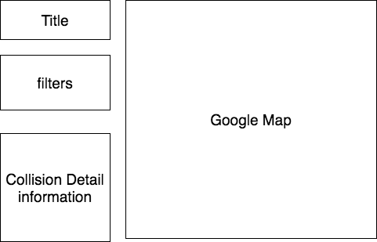

# CollisionViz

## Background
CollisionViz is a web application which visualizes the location and time of all the motor vehicle collisions during a certain period of time in New York City. It uses a Rails backend and an SQLite database to store the collision data. Currently, it shows collisions on 6/22/2017. Data is from NYPD.

## Functionality & MVP
CollisionViz will put markers on a embedded Google Map of NYC based on the longitude and latitude of the collision. Users will be able to filter the collisions based on the time and location (map border) they happened. A production README is also needed.

## Wireframes

## Technologies
* JavaScript
* NYPD Data
* Google Maps API

Data provided by NYPD (to be stored in database)
* Date
* Time
* Longitude
* Latitude

## Implementation Timeline
**Phase 1** Import the needed data from NYPD to the database. Setup necessary backend (Rails) and frontend (node modules) backbone. Display all the collisions on the Google Map.

**Phase 2** Filter the collisions by location (map border) and time.

**Phase 3** Animation: make markers appear and disappear on map based on collision time.

**Bonus** Show stats (current time, number of collisions in the last hour) and more detailed information about the collision.

Reference:
[A Day in the Life of Citi Bike](https://mallorybulkley.com/citi-bike-visualization/)
